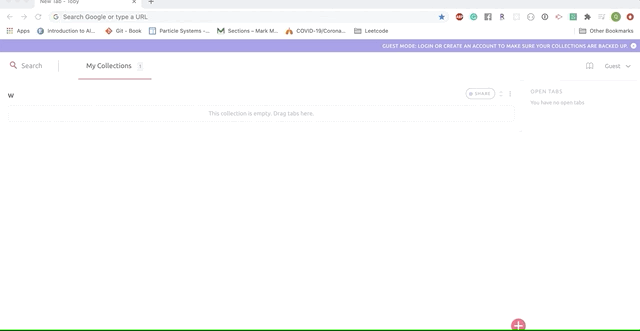

# Go Links
A browser extension for creating personal URL shortcuts. Available on Chrome and Firefox.

## Installation

### Chrome

https://chrome.google.com/webstore/detail/go-links/gojgbkejhelijlkgpmlbbkklljgmfljj?h1=en

### Firefox

https://addons.mozilla.org/en-US/firefox/addon/go-links/

## How to use

    
Create a new URL shortcut

### Create a new URL shortcut
1. Go to the website you want to create the shortcut for.
2. Open Go Links.
3. Click "Add new shortcut"
4. Fill in your shortcut.
5. Click "Save" button.

    
Access the website

### Access the website
#### With the shortcut
1. In the current tab or in a new tab, type "go/your-shortcut".
2. It will redirect you to the website you saved.

#### With the extension popup
1. Open Go Links.
2. Click on the shortcut entry.
3. The website will be opened in a new tab.

    
Search for a shortcut

### Search for a shortcut
1. Open Go Links.
2. Search for your shortcut using the search box.

    
Delete a shortcut

### Delete a shortcut
1. Open Go Links.
2. Hover your mouse on the shortcut entry you want to delete.
3. Click on the trash icon.
4. Confirm your selection.

    
Overwrite a shortcut

### Overwrite a shortcut
1. Go to the new website for which you want to use the shortcut.
2. Open Go Links.
3. Click "Add new shortcut".
4. Type in the shortcut you want to overwrite.
5. Click "Overwrite" button. The existed shortcut will be mapped to the new website.

